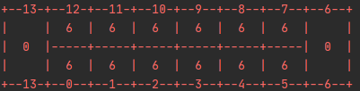
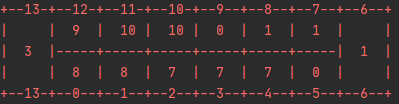
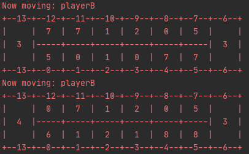
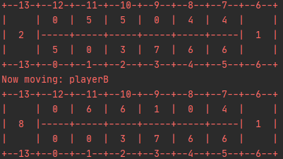
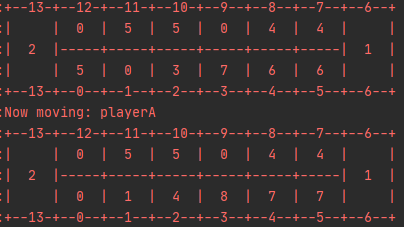

# Sztuczna Inteligencja - laboratorium

## Zad 3 - Gry, Mancala

### Opis

Algorytm pozwala na rozgrywkę w grę **Mankala**. Możliwa jest rozgrywka w 2 graczy. 
Każdy gracz posiada 6 "dołków" oraz bazę. 
Na początku rozgrywki w każdym dołku (w równej ilości) umieszczone zostają kamyki/fasolki.  
Przykładowy początkowy stan planszy:  
  
Dołki gracza A: 0 - 5 + baza na pozycji 6  
Dołki gracza B: 7 - 12 + baza na pozycji 13  
Gracze kolejno wybierają dołek z którego przeniesione zostają wszystkie fasolki.
Zostają one rozłożone w kolejnych dołkach oraz bazach. Przykładowo jeśli gracz A wybieze dołek 3, 
to zabiera z niego wszystkie fasolki, i rozkłada je kolejno na pozycjach 4,5,6,7,8,9.
Jeśli ostatnia fasolka wyląduje w pustym dołku należącym do gracza rozkładającego fasolki, 
a przeciwny dołek przeciwnika nie jest pusty, gracz zabiera swoją fasolkę oraz 
fasolki przeciwnika z dołka na przeciw i umieszcza je w swojej bazie.  
Na przykład w tej sytuacji:  
  
Jeśli gracz B wybierze dołek 8, jedna fasolka zostanie przesunięta do dołka 9, a skoro jest pusty
to gracz B zabiera wszystkie fasolki z przeciwnego dołka 3.  
W ten sposób do bazy gracza B trafia 8 dodatkowych fasolek (1 własna + 7 przeciwnika).  
Fasolki znajdujące się w bazie nie mogą zostać usunięte w żaden sposób.
Jeśli ostatnia fasolka wyląduje w "swojej" bazie, gracz otrzymuje jeszcze jeden ruch. 

Gra kończy się gdy jeden z graczy nie może już wykonać żadnego ruchu. 
Po zakończeniu gry, gracze zbierają fasolki znajdujące się po swojej stronie planszy
i wkładają je do swojej bazy. Wygrywa gracz z większą liczbą fasolek w bazie.

Możliwe są 3 typy rozgrywki:
Każdy z trybów znajduje się w osobnym pliku `.py`.
Są to kolejno:
- [gracz vs gracz](src/player_vs_player.py)
- [gracz vs komputer](src/player_vs_ai.py)
- [komputer vs komputer](src/ai_vs_ai.py)

### Wymagania
Algorytm został zaimplementowany w pythonie 3.9.

### Jak skonfigurować?

Konfiguracja odbywa się bezpośrednio w kodzie kontrolera rozgrywki.
Na chwilę obecną można zmiennymi parametrami są:
- beans_per_pit (fasolki na dołek) - domyślnie 4.
- depth (głębokość drzewa przeszukiwań) domyślnie 6.
- first_move_random - czy pierwszy ruch komputera ma być losowy (dostępne tylko w trybie [komputer vs komputer](src/ai_vs_ai.py)).
- player - pozwala na ustawienie losowego gracza rozpoczynającego lub na ustawienie wybranego.
- algorithm - algorytm używany przez komputer do wybrania kolejnego ruchu

## Algorytmy wyboru
Aktualnie dostępne algorytmy wybierające następny ruch komputera:
- MinMax
- AlphaBeta pruning

Dla większych głębokości przeszukiwań algorytmy znacząco różnią się szybkością działania:  
  

oraz ilością odwiedzonych stanów:  

## Testy funkcjonalne
Komputer potrafi wykryć następujące sytuacje (przy ustawionej odpowiedniej wartości depth):
- Gracz B może ponownie wykonać ruch
  

- Możliwe jest bicie przez gracza B  
  

- Możliwość przez Gracza B - gracz A usuwa swoje fasolki z narażonego dołka  
  
